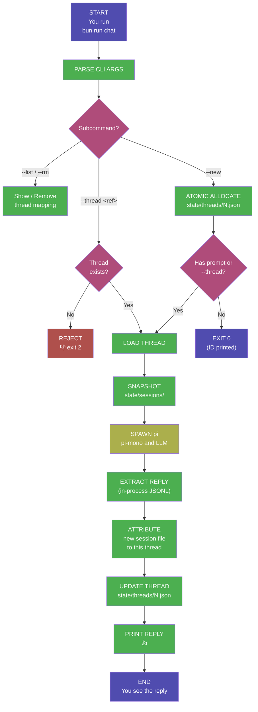

# GitHub Society Intelligence — VS Code Edition

A repository-local AI framework that plugs into a developer's existing workflow. **This guide covers running the agent entirely on your own machine inside Visual Studio Code** — no GitHub Issues, no GitHub Actions, no `gh` CLI, no push to a remote. The agent still uses Git as persistent versioned memory and lives inside your repo as a single folder, delivering low-infrastructure, auditable, user-owned automation by writing every prompt/response transcript next to your code.

> Looking for the GitHub-hosted workflow (Issues-as-conversation, Actions runtime)? See [README.md](README.md). The two entry points are siblings — they share the same `pi` agent, the same `.pi/` configuration, the same skills, and the same session-transcript format. Only the I/O surface differs.

### Please read [this](docs/final-warning.md) before you install this AI Agent.

## Installation

> A complete one-time setup takes ~3 minutes. Steps 1–4 are required; step 5 (editor / TypeScript) is optional but recommended for a clean VS Code experience.

### 1. Clone or open the repository

Open in VS Code any repository that already contains the `.github-society-intelligence/` folder.

### 2. Install Bun (the runtime)

Bun is the only compute layer the agent needs — no Node.js, no Docker, no server.

**Windows (PowerShell)**
```powershell
irm bun.sh/install.ps1 | iex
```
Then **close and reopen your terminal** so the new `PATH` entry takes effect. Verify:
```powershell
bun --version
```

**macOS / Linux**
```bash
curl -fsSL https://bun.sh/install | bash
exec $SHELL -l
bun --version
```

### 3. Install dependencies

```powershell
cd .github-society-intelligence
bun install
```
This installs:

| Package | Purpose |
|---|---|
| `@earendil-works/pi-coding-agent` | The `pi` binary that drives every turn. |
| `marked` + `marked-terminal` | Render assistant Markdown replies in the terminal. |
| `ansi-regex` | Strip stray ANSI escape codes before rendering. |
| `@types/bun`, `@types/node`, `@types/marked-terminal` (dev) | Type definitions for the editor — runtime not affected. |

### 4. Set an LLM API key

Set it as an environment variable in the terminal session that will launch the agent.

**One-off (PowerShell)**
```powershell
$env:OPENAI_API_KEY = "sk-..."
```

**Persistent (PowerShell user profile)**
```powershell
notepad $PROFILE
# Add: $env:OPENAI_API_KEY = "sk-..."
```

**Persistent (macOS / Linux)**
```bash
echo 'export OPENAI_API_KEY="sk-..."' >> ~/.zshrc   # or ~/.bashrc
```

> Don't have a cloud key? Skip ahead to [Local LLMs (LM Studio / Ollama / vLLM)](#local-llms-lm-studio--ollama--vllm) — the runner has first-class support for OpenAI-compatible local servers.

> If you just run `bun run chat` without setting a key, the runner now drops you into a **guided recovery menu** that lets you paste a key for the session, switch to a local LLM, or print persistence instructions. Nothing crashes.

### 5. Editor & TypeScript setup (optional, recommended)

`local-chat.ts` runs under Bun, which **does not require a TypeScript compile step** — `bun run chat` executes the file directly. However, VS Code's bundled TypeScript checker will show squiggles for `process`, `fs`, `Bun`, etc. unless type definitions are visible to it.

Step 3 already installs the dev `@types/*` packages. To make VS Code pick them up, add a `tsconfig.json` next to `package.json`:

```jsonc
// .github-society-intelligence/tsconfig.json
{
  "compilerOptions": {
    "target": "ES2022",
    "module": "ESNext",
    "moduleResolution": "bundler",
    "types": ["bun", "node"],
    "lib": ["ES2022"],
    "strict": false,
    "noEmit": true,
    "allowJs": true,
    "esModuleInterop": true,
    "skipLibCheck": true,
    "resolveJsonModule": true
  },
  "include": ["lifecycle/**/*.ts"]
}
```

Reload the editor (`Ctrl+Shift+P` → "Developer: Reload Window"). All editor errors in `local-chat.ts` and `agent.ts` will clear. Nothing about the runtime changes — this is purely for the IDE.

### 6. Start your first thread

```powershell
bun run chat                          # interactive launcher (pick or create)
bun run chat --new                    # explicitly create a new thread
bun run chat --thread 1               # resume thread #1 (REPL)
bun run chat --thread 1 "hello"       # one-shot prompt against thread #1
```
<p align="center">
  <picture>
    
  </picture>
</p>

## An AI agent that lives in your VS Code workspace

[](https://opensource.org/licenses/MIT) 

Powered by [pi-mono](https://github.com/earendil-works/pi), conversation history is written to your local working tree, giving your agent long-term memory across sessions. It can search prior context, edit or summarize past conversations, and every transcript is a plain `.jsonl` file you can read, diff, or version yourself.

---

## Your Data, Your Environment

With a typical LLM, a developer constantly moves between their repository and someone else's interface. They ask the model to explain code, trace bugs, suggest refactors, write tests, draft documentation, or plan changes, but each prompt and response lives outside the repo itself. Code is copied out of chat windows and pasted back into editors, while the reasoning, decisions, and project-specific knowledge built along the way end up scattered across browser tabs, chat histories, and third-party platforms instead of being preserved with the code.

**Society Intelligence flips that model.** Every prompt you type in the VS Code terminal and every response the agent produces is written directly to your working tree as part of its normal workflow. There is nothing to copy, nothing to paste, and nothing stored outside your control — not even on GitHub.

- **Ask a question** → the answer is in your workspace as a session transcript.
- **Request a file change** → the agent edits the file; the change shows up in VS Code's Source Control panel for you to review and commit.
- **Continue a conversation weeks later** → resume the thread by ID; the agent reloads its full history.

Your repository _is_ the AI workspace. The questions, the results, the code, the context — it all lives where your work already lives, on disk, owned entirely by you.

---

## Why the VS Code Edition

| Capability | Why it matters |
|---|---|
| **Zero network dependencies (besides the LLM)** | No GitHub, no Actions, no remote. Runs fully air-gapped from GitHub. |
| **Works offline-from-GitHub** | Useful on private forks, disconnected machines, or repos hosted elsewhere (GitLab, Gitea, Codeberg, no remote at all). |
| **No commit/push noise** | The local runner never mutates git for you — you decide what to stage and when, using VS Code's normal Source Control UI. |
| **Cross-platform** | Pure Bun + JS; no `bash`/`tac`/`jq`/`tee` dependencies. Works natively on Windows PowerShell, macOS, and Linux. |
| **Closed-world thread identity** | Thread IDs are monotonic integers allocated atomically by the runner — typos cannot fork conversations and concurrent runs cannot collide. |
| **Persistent memory** | Conversation transcripts are written to `state/sessions/` — the agent remembers everything across sessions. |
| **Multi-provider LLM support** | Same provider table as the GitHub edition: Anthropic, OpenAI, Google Gemini, xAI, DeepSeek, Mistral, Groq, OpenRouter. |
| **Modular skill system** | Agent capabilities are self-contained Markdown files in `.pi/skills/` — shared verbatim with the GitHub edition. |

---

## How It Works

The entire system runs as a closed loop inside your local working tree. When you start a turn in the VS Code terminal, the runner launches the `pi` agent, which reads your message, thinks, responds, and writes its transcript — all without leaving your machine.



The runner that drives this loop is [`lifecycle/local-chat.ts`](lifecycle/local-chat.ts) — the local sibling of `agent.ts`. It removes every GitHub-specific dependency (`gh` CLI, `GITHUB_EVENT_PATH`, `git push`, `tac`/`jq`/`tee`) and replaces them with cross-platform equivalents (stdin/stdout REPL, in-process JSONL parsing, no git mutation).

### Key Concepts

| Concept | Description |
|---|---|
| **Thread = Conversation** | Each thread maps to a persistent AI conversation. Resume by ID or alias to continue where you left off. |
| **Local files = Memory** | Session transcripts are written under `state/sessions/`. The agent has full recall of every prior exchange on the thread you resume. |
| **Bun = Runtime** | Bun is the only compute layer. No servers, no containers, no Actions runner, no Docker. |
| **Working tree = Storage** | All state — sessions, thread mappings, and any agent edits — lives in your working tree. **You** decide what to commit. |
| **Closed-world identity** | Thread IDs are allocated by the tool, never by you. A typo (`--thread scrach`) is rejected with an error, never silently forked into a new thread. |

### State Management

All state lives in your working tree:

```
.github-society-intelligence/state/
  threads/
    1.json          # maps thread #1 → its session file (local edition)
    2.json
  sessions/
    2026-02-04T..._abc123.jsonl    # full conversation transcript
```

Each thread is identified by an integer **owned by the runner**, mirroring the way GitHub owns issue numbers in the production edition: `thread #N` → `state/threads/N.json` → `state/sessions/<session>.jsonl`. When you resume the thread weeks later, the runner loads that linked session and passes it to `pi` via `--session`. No database, no session cookies, no remote service — just files.

The `state/sessions/` directory is git-tracked by default (same as the GitHub edition); the local-only `state/threads/` directory is git-ignored so your scratch conversations never accidentally land in a commit.

---

## Prerequisites

- A local clone of a repository containing the `.github-society-intelligence/` folder
- [Bun](https://bun.sh/) installed and on `PATH`
- VS Code (any recent version; the integrated terminal is all that's required)
- An API key from your chosen LLM provider (see [Supported providers](#supported-providers) below)

---

## Add Your API Key

Set it as an environment variable in the terminal session that will launch the agent. VS Code's integrated terminal inherits from the shell it's launched from, so for persistent setups consider your shell profile or `.env` loader of choice.

### One-off (PowerShell)
```powershell
$env:OPENAI_API_KEY = "sk-..."
```

### Persistent (PowerShell user profile)
```powershell
notepad $PROFILE
# Add: $env:OPENAI_API_KEY = "sk-..."
```

### Persistent (macOS/Linux)
```bash
echo 'export OPENAI_API_KEY="sk-..."' >> ~/.zshrc   # or ~/.bashrc
```

| Provider | Variable name | Where to get it |
|----------|---------------|-----------------|
| Anthropic | `ANTHROPIC_API_KEY` | [console.anthropic.com](https://console.anthropic.com/) |
| OpenAI | `OPENAI_API_KEY` | [platform.openai.com](https://platform.openai.com/) |
| Google Gemini | `GEMINI_API_KEY` | [aistudio.google.com](https://aistudio.google.com/) |
| xAI (Grok) | `XAI_API_KEY` | [console.x.ai](https://console.x.ai/) |
| DeepSeek (via OpenRouter) | `OPENROUTER_API_KEY` | [openrouter.ai](https://openrouter.ai/) |
| Mistral | `MISTRAL_API_KEY` | [console.mistral.ai](https://console.mistral.ai/) |
| Groq | `GROQ_API_KEY` | [console.groq.com](https://console.groq.com/) |

> The runner verifies the variable matching your configured provider is set, and exits with a clear message if it isn't. You can still run `--list` / `--rm` without a key — only turns that actually call the LLM require it.

---

## What Happens When You Start a Thread

```
You run `bun run chat --new`
    → The runner atomically allocates the next thread ID (e.g. #1)
    → state/threads/1.json is written with an empty session pointer
    → You start the conversation with `bun run chat --thread 1`
    → `pi` runs against your prompt; its reply prints to the terminal
    → The new session transcript is attributed to thread #1
    → Any file edits the agent made appear in VS Code's Source Control panel
```

Resume the same thread later (next day, next week) with `bun run chat --thread 1` — the agent picks up with full context from the saved session transcript.

---

## VS Code Workflow

The runner is a CLI, so any VS Code feature that drives the terminal works.

### Recommended setup

1. **Pin a terminal.** Open the integrated terminal (`Ctrl+\``), run `cd .github-society-intelligence`, and pin the tab. All `bun run chat …` invocations live there.
2. **Use Source Control for review.** When the agent edits files, they appear in the Source Control panel (`Ctrl+Shift+G`). Diff each change before staging — exactly the same review flow you'd use for any other patch.
3. **Watch transcripts live.** Open the latest file under `.github-society-intelligence/state/sessions/` in a split editor; VS Code will tail it as `pi` writes events.
4. **(Optional) Add a `tasks.json` entry** so you can launch threads from the Command Palette:
   ```jsonc
   // .vscode/tasks.json
   {
     "version": "2.0.0",
     "tasks": [
       {
         "label": "MI: new thread",
         "type": "shell",
         "command": "bun run chat --new",
         "options": { "cwd": "${workspaceFolder}/.github-society-intelligence" },
         "presentation": { "reveal": "always", "panel": "shared" }
       },
       {
         "label": "MI: list threads",
         "type": "shell",
         "command": "bun run chat --list",
         "options": { "cwd": "${workspaceFolder}/.github-society-intelligence" }
       }
     ]
   }
   ```
   Then `Ctrl+Shift+P → Tasks: Run Task → MI: new thread`.

### CLI reference

```
bun run chat --new [--name <alias>]            Create a new thread; prints its ID.
bun run chat --thread <id|alias> [prompt...]   Continue a thread. REPL if no prompt.
bun run chat --list                            List all threads.
bun run chat --rm <id|alias>                   Delete a thread mapping (transcript preserved).
bun run chat --help                            Show usage.
```

Exit codes:

| Code | Meaning |
|---|---|
| 0 | Success |
| 1 | Environment problem (missing API key, missing `pi` binary) |
| 2 | User error (unknown thread, taken alias, malformed args) |

### Identity model — closed world

The hardest design problem in a local equivalent of "Issues-as-conversation" is identity. GitHub solves this for the production edition by *owning* issue numbers: you cannot pick them, cannot collide, and cannot accidentally re-use an old one. The local runner reproduces that property:

1. Thread IDs are monotonic integers allocated by this tool, **never** by you. Each thread is persisted as `state/threads/<N>.json`.
2. Allocation is atomic: `openSync(path, "wx")` either creates the file or fails with `EEXIST`. Concurrent `--new` invocations cannot claim the same ID.
3. An optional `--name <alias>` may be attached, but the alias is layered *over* the ID. Alias collisions are rejected at creation time with a clear error pointing at the existing thread — never silently merged.
4. `--thread <ref>` requires `<ref>` to resolve to an existing thread. Unknown references exit non-zero. **A typo cannot fork a new thread.**
5. Alias grammar (`[A-Za-z][A-Za-z0-9_-]{0,63}`) forbids pure-digit aliases, so IDs and names can never be confused.

---

## Hatching — Give the Agent a Personality

Use the **🥚 Hatch** prompt from the GitHub edition equivalently here: simply start a thread and ask the agent to hatch — it will walk you through naming itself and shaping its personality, then write the result to `AGENTS.md`.

```powershell
bun run chat --new --name hatch
bun run chat --thread hatch "Let's go through the hatching process."
```

This is optional. The agent works without hatching, but it's more fun with a personality.

---

## Project Structure

```
.github-society-intelligence/
  .pi/                              # Agent personality & skills config
    settings.json                   # LLM provider, model, and thinking level
    APPEND_SYSTEM.md                # System prompt loaded every session
    BOOTSTRAP.md                    # First-run identity prompt
    skills/                         # Modular skill packages
  install/
    SOCIETY-INTELLIGENCE-AGENTS.md  # Default agent identity template
    settings.json                   # Default LLM settings template
  lifecycle/
    agent.ts                        # GitHub Actions entry point (not used locally)
    local-chat.ts                   # Local VS Code entry point  ← this guide
  docs/                             # Documentation and analysis
  public-fabric/                    # GitHub Pages static site (not used locally)
  state/
    threads/                        # Local thread mappings (git-ignored)
    sessions/                       # Session transcripts (git-tracked)
  logo.png                          # Agent logo
  AGENTS.md                         # Agent identity file
  VERSION                           # Installed version
  package.json                      # Runtime dependencies + `chat` npm script
```

---

## Configuration

**Change the model** — edit `.github-society-intelligence/.pi/settings.json`. The local runner reads this file on every turn, so changes take effect on the next invocation. All provider blocks from the GitHub edition apply unchanged:

<details>
<summary><strong>OpenAI - GPT-5.4 (default)</strong></summary>

```json
{
  "defaultProvider": "openai",
  "defaultModel": "gpt-5.4",
  "defaultThinkingLevel": "high"
}
```

Requires `OPENAI_API_KEY`.
</details>

<details>
<summary><strong>Anthropic</strong></summary>

```json
{
  "defaultProvider": "anthropic",
  "defaultModel": "claude-opus-4-6",
  "defaultThinkingLevel": "high"
}
```

Requires `ANTHROPIC_API_KEY`.
</details>

<details>
<summary><strong>OpenAI - GPT-5.3 Codex Spark</strong></summary>

```json
{
  "defaultProvider": "openai",
  "defaultModel": "gpt-5.3-codex-spark",
  "defaultThinkingLevel": "medium"
}
```

Requires `OPENAI_API_KEY`.
</details>

<details>
<summary><strong>DeepSeek (via OpenRouter)</strong></summary>

```json
{
  "defaultProvider": "openrouter",
  "defaultModel": "deepseek/deepseek-r1",
  "defaultThinkingLevel": "medium"
}
```

Requires `OPENROUTER_API_KEY`.
</details>

<details>
<summary><strong>xAI - Grok</strong></summary>

```json
{
  "defaultProvider": "xai",
  "defaultModel": "grok-3",
  "defaultThinkingLevel": "medium"
}
```

Requires `XAI_API_KEY`.
</details>

<details>
<summary><strong>Google Gemini - gemini-2.5-pro</strong></summary>

```json
{
  "defaultProvider": "google",
  "defaultModel": "gemini-2.5-pro",
  "defaultThinkingLevel": "medium"
}
```

Requires `GEMINI_API_KEY`.
</details>

<details>
<summary><strong>Google Gemini - gemini-2.5-flash</strong></summary>

```json
{
  "defaultProvider": "google",
  "defaultModel": "gemini-2.5-flash",
  "defaultThinkingLevel": "medium"
}
```

Requires `GEMINI_API_KEY`. Faster and cheaper than gemini-2.5-pro.
</details>

<details>
<summary><strong>xAI - Grok Mini</strong></summary>

```json
{
  "defaultProvider": "xai",
  "defaultModel": "grok-3-mini",
  "defaultThinkingLevel": "medium"
}
```

Requires `XAI_API_KEY`.
</details>

<details>
<summary><strong>DeepSeek Chat (via OpenRouter)</strong></summary>

```json
{
  "defaultProvider": "openrouter",
  "defaultModel": "deepseek/deepseek-chat",
  "defaultThinkingLevel": "medium"
}
```

Requires `OPENROUTER_API_KEY`.
</details>

<details>
<summary><strong>Mistral</strong></summary>

```json
{
  "defaultProvider": "mistral",
  "defaultModel": "mistral-large-latest",
  "defaultThinkingLevel": "medium"
}
```

Requires `MISTRAL_API_KEY`.
</details>

<details>
<summary><strong>Groq</strong></summary>

```json
{
  "defaultProvider": "groq",
  "defaultModel": "deepseek-r1-distill-llama-70b",
  "defaultThinkingLevel": "medium"
}
```

Requires `GROQ_API_KEY`.
</details>

<details>
<summary><strong>OpenRouter (any model)</strong></summary>

```json
{
  "defaultProvider": "openrouter",
  "defaultModel": "your-chosen-model",
  "defaultThinkingLevel": "medium"
}
```

Requires `OPENROUTER_API_KEY`. Browse available models at [openrouter.ai](https://openrouter.ai/).
</details>

**Make it read-only** — edit the `--tools` argument in [`lifecycle/local-chat.ts`](lifecycle/local-chat.ts) from `read,bash,edit,write,grep,find,ls` to `read,grep,find,ls`. The agent will be able to inspect your workspace but not modify it or run shell commands.

**Adjust thinking level** — set `defaultThinkingLevel` to `"low"`, `"medium"`, or `"high"` in `settings.json` for different task complexities.

**Share threads with a teammate** — commit `state/sessions/*.jsonl` (it's git-tracked); they pull, run `bun run chat --new`, then manually edit `state/threads/<their-new-id>.json` to point `sessionPath` at the shared transcript. The local edition deliberately doesn't auto-share thread *mappings* (those are personal scratch state).

### Environment variable overrides

These take precedence over `.pi/settings.json` on a per-session basis — useful for trying a different model without editing the settings file.

| Variable | Effect |
|---|---|
| `LOCAL_PROVIDER` | Override `defaultProvider` for this session. |
| `LOCAL_MODEL` | Override `defaultModel`. |
| `LOCAL_THINKING` | Override `defaultThinkingLevel` (`low` / `medium` / `high`). |
| `LOCAL_LLM_BASE_URL` | Point an OpenAI-compatible client at a local server (see next section). Forwarded into `OPENAI_BASE_URL`; a placeholder `OPENAI_API_KEY=local` is injected so the SDK won't reject the request. |
| `NO_COLOR` / `FORCE_COLOR` | Disable / force ANSI colour in the launcher and REPL banners. |

Example:
```powershell
$env:LOCAL_MODEL = "gpt-5.3-codex-spark"
bun run chat
```

### Local LLMs (LM Studio / Ollama / vLLM)

The runner natively supports any OpenAI-compatible local server. Two ways to enable it:

**(a) Interactive** — just run `bun run chat` with no cloud key set. The guided menu offers "Use a local LLM instead" and walks through the setup.

**(b) Manual env vars** — for repeatable / scripted use:

```powershell
# LM Studio (default port 1234)
$env:LOCAL_LLM_BASE_URL = "http://localhost:1234/v1"
$env:LOCAL_MODEL        = "qwen2.5-coder-32b-instruct"
bun run chat

# Ollama (default port 11434)
$env:LOCAL_LLM_BASE_URL = "http://localhost:11434/v1"
$env:LOCAL_MODEL        = "deepseek-r1:32b"
bun run chat

# vLLM (default port 8000)
$env:LOCAL_LLM_BASE_URL = "http://localhost:8000/v1"
$env:LOCAL_MODEL        = "your-served-model"
bun run chat
```

Auto-retry is enabled by default for local providers (they're often slow/flaky on first call); you can change it with `/auto-retry off` in the REPL.

You can also write a permanent local setup into `.pi/settings.json`:
```json
{
  "defaultProvider": "lmstudio",
  "defaultModel": "qwen2.5-coder-32b-instruct"
}
```
`lmstudio` is a first-class provider value (treated as local; no API key required).

> **`defaultThinkingLevel` and local models.** Many local models (especially smaller quantised ones) reject the `--thinking` flag with an `unknown_field` error. If yours does, **delete the `defaultThinkingLevel` line from `.pi/settings.json`** (or unset `LOCAL_THINKING`) — the runner only passes `--thinking` when the field is present.

### REPL slash-commands quick reference

When you enter a thread without a one-shot prompt (e.g. `bun run chat --thread 1` or any interactive launch), you're dropped into a REPL. Type `/help` inside it for the full grouped listing; the common ones:

| Command | Effect |
|---|---|
| `/help` | Show full command list. |
| `/status` | Provider, model, thread, git branch, memory count, toggles. |
| `/list` / `/new [name]` / `/switch <ref>` / `/rename <name>` | Thread management. |
| `/history` / `/export md` | Inspect or export this thread's conversation. |
| `/model <name>` | Switch model for subsequent turns. |
| `/time` / `/verbose` | Toggle elapsed-time / JSONL event-count display. |
| `/auto-retry [on\|off\|N]` | Toggle or set max retry attempts. |
| `/remember <text>` / `/memories [term]` | Append/search the local `memory.log`. |
| `/cat <path>` / `/md <path>` | View a file (numbered) or render its Markdown. |
| `/git` / `/diff [path]` | Git status / diff stat / scoped diff. |
| `/run <cmd>` | Run a shell command (30 s timeout). |
| `/retry` / `/again` / `/best-of <n>` | Re-send last prompt (same thread / new thread / N parallel attempts). |
| `/multiline` | Compose multi-line input (blank line submits). |
| `/clear` | Clear the screen. |
| `/exit` / `/quit` | End the session. |

The REPL prompt shows your repo name, current branch, thread ID, and alias:
```
github-society-intelligence (main) #1 [hatch] >
```

---

## Supported Providers

The local edition uses the same provider table as the GitHub edition. Set `defaultProvider` and `defaultModel` in `.github-society-intelligence/.pi/settings.json` and export the matching API key:

| Provider | `defaultProvider` | Example model | API key env var |
|----------|-------------------|---------------|-----------------|
| OpenAI | `openai` | `gpt-5.4` (default), `gpt-5.3-codex`, `gpt-5.3-codex-spark` | `OPENAI_API_KEY` |
| Anthropic | `anthropic` | `claude-sonnet-4-20250514` | `ANTHROPIC_API_KEY` |
| Google Gemini | `google` | `gemini-2.5-pro`, `gemini-2.5-flash` | `GEMINI_API_KEY` |
| xAI (Grok) | `xai` | `grok-3`, `grok-3-mini` | `XAI_API_KEY` |
| DeepSeek | `openrouter` | `deepseek/deepseek-r1`, `deepseek/deepseek-chat` | `OPENROUTER_API_KEY` |
| Mistral | `mistral` | `mistral-large-latest` | `MISTRAL_API_KEY` |
| Groq | `groq` | `deepseek-r1-distill-llama-70b` | `GROQ_API_KEY` |
| OpenRouter | `openrouter` | any model on [openrouter.ai](https://openrouter.ai/) | `OPENROUTER_API_KEY` |

> **Tip:** The `pi` agent supports many more providers and models. Run `bun run pi --help` from `.github-society-intelligence/` or see the [pi-mono docs](https://github.com/earendil-works/pi) for the full list.

---

## Security

The local runner is bound by your operating system's user permissions — it can do anything you can do as the user running it. **In particular, by default the agent has the `bash`, `edit`, and `write` tools enabled**, which means it can run arbitrary shell commands and modify any file in your workspace. Audit prompts you send and review every change in the Source Control panel before committing.

If you want a strictly read-only configuration, edit the `--tools` list in `lifecycle/local-chat.ts` to remove `bash`, `edit`, and `write` (see [Configuration](#configuration)).

Your API key never leaves your machine except in outbound requests to your configured LLM provider. The runner makes no network calls of its own.

---

## Comparison with the GitHub Edition

| Concern | GitHub edition (`agent.ts`) | VS Code edition (`local-chat.ts`) |
|---|---|---|
| **Trigger** | GitHub Issues / issue comments | `bun run chat` in the terminal |
| **Identity** | GitHub-allocated issue number | Runner-allocated integer thread ID |
| **Reply surface** | Issue comment posted via `gh` | Terminal stdout |
| **Storage** | Pushed to default branch by the bot | Lives in your working tree; you commit when you want |
| **Runtime** | GitHub Actions | Local Bun |
| **Required CLIs** | `gh`, `git`, `bash`, `tac`, `jq`, `tee` | Bun only |
| **OS** | Linux runner (GitHub-hosted) | Any OS Bun supports (Windows/macOS/Linux) |
| **Network** | GitHub + LLM | LLM only |
| **Auditability** | Git history on remote | Git history locally + plaintext transcripts |
| **Authorisation** | Repo owners/members/collaborators | Whoever has shell access to your machine |
| **Shared with team** | Yes (via GitHub) | No (private to your machine unless you commit + push transcripts) |

The two entry points are deliberately compatible: a session transcript written by one can be resumed by the other.

---

## Troubleshooting

**`bun: The term 'bun' is not recognized…`** — Bun isn't on `PATH`. Close and reopen the terminal after installing Bun so the new `PATH` entry takes effect. On Windows the installer drops `bun.exe` at `%USERPROFILE%\.bun\bin\bun.exe`.

**`pi binary not found at …\node_modules\.bin\pi.cmd`** — you skipped step 3 of Installation. Run `bun install` inside `.github-society-intelligence/`. The runner now also prints a friendly box with the fix commands instead of throwing.

**`Missing env var OPENAI_API_KEY for provider "openai".`** — *no longer crashes.* The runner shows a guided menu offering to (1) paste a key for this session, (2) switch to a local LLM, (3) print persistence instructions, or (q) quit. To set the key permanently see [Add Your API Key](#add-your-api-key). PowerShell tabs do not share environment with other tabs.

**VS Code shows red squiggles on `process`, `fs`, `Bun`, `import.meta.dir` etc.** — purely cosmetic; the script runs fine under `bun run`. Add the `tsconfig.json` from [step 5 of Installation](#5-editor--typescript-setup-optional-recommended) and reload the window to clear them.

**`Unknown thread "scratch". Use --list to see threads, or --new to create one.`** — the closed-world identity model rejecting an unknown reference. Either you typed an ID/alias that doesn't exist, or the mapping file was deleted. Use `--list` to see what's available, or run `bun run chat` with no args for the interactive picker.

**`pi did not create a session file for this turn — refusing to guess …`** — `pi` exited before producing a transcript (often a transient provider error printed to stderr just above the message). Inspect the stderr output, fix the underlying issue, and re-run; the thread mapping is untouched so you can retry safely. With auto-retry enabled (default for local providers) you'll see `⟳ Retry N/M` messages before the final failure.

**Local LLM connections refused / hanging.** — Confirm the server is actually listening: `curl http://localhost:1234/v1/models` (LM Studio) or the equivalent for your runner. The runner forwards `LOCAL_LLM_BASE_URL` into `OPENAI_BASE_URL` and injects a placeholder key automatically — you don't need to set those yourself.

**The agent edited files I didn't expect.** — review them in the Source Control panel and discard. Consider switching to the read-only tool list (see [Configuration](#configuration)) for sensitive workspaces.

---

<p align="center">
  <picture>
    
  </picture>
</p>
