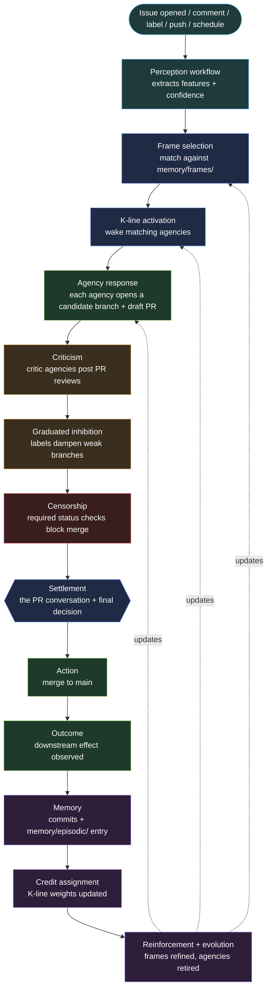

# DESIGN-1 — Minsky on GitHub

### A first great attempt at implementing *The Society of Mind* using repo-based AI agents that think on branches

> The forge is the mind. The repo is an agency. The branch is a thought. The pull request is a proposal. The review is criticism. The merge is a committed change to the organism.

This document is a *first great attempt* — not a final specification. It is the smallest design that takes Marvin Minsky's *Society of Mind* seriously and maps it, end-to-end, onto primitives that already exist inside GitHub: **repositories, branches, issues, pull requests, reviews, labels, commits, Actions, and merges**. It draws directly on the deep research held under [`research/THE-SOCIETY-OF-REPO/`](research/THE-SOCIETY-OF-REPO/README.md) and the source-text companion under [`research/THE-SOCIETY-OF-MIND/`](research/THE-SOCIETY-OF-MIND/) but takes a strong, opinionated position about *what to build first*.

The goal is concrete: a developer can install this on a GitHub repository and, within an hour, watch a small society of agents wake, propose on branches, criticise each other in pull requests, get blocked by censors, settle, merge, remember, and learn — all inside GitHub, with no external infrastructure.

---

## 1. The core bet

There is one bet underneath this whole design:

> **A Git branch is the natural physical substrate for a Minsky-style "thought".**

A branch is:

- **Insulated** — changes do not contaminate `main` until explicitly merged. This is exactly Minsky's *insulation principle*: protected partial independence between subsystems.
- **Speculative** — it is one possible future, not the future. Many branches can coexist as competing continuations.
- **Inspectable** — every step is a commit. The trace is the artifact.
- **Cheap** — branches are free, fast, and disposable. A society can entertain many simultaneously without committing to any.
- **Composable** — branches can be merged, rebased, abandoned, cherry-picked, or fast-forwarded. These are the operators of a thinking process.
- **Reviewable** — pull requests give us a built-in surface for criticism, censorship, settlement, and approval.

In one line:

```
A branch is an insulated future. A thought is a branch.
A pull request is a proposal to commit that thought to the organism.
```

Every other design decision in this document follows from this bet.

---

## 2. Minsky's vocabulary, mapped to GitHub

The full term-by-term crosswalk lives under [`research/THE-SOCIETY-OF-MIND/12-crosswalk-to-society-of-repo.md`](research/THE-SOCIETY-OF-MIND/). DESIGN-1 narrows that map to the **minimum set** an implementation needs to be honestly Minskyan on GitHub:

| Minsky concept | GitHub primitive | Notes |
| --- | --- | --- |
| **Agent** (small bounded process) | A handler function inside an agency repo (`.github-society-intelligence/agencies/<name>/handler.ts`) | One job. One signal. No identity beyond its function. |
| **Agency** (constitutional unit of governance) | A directory or repository with a `constitution.yaml` and a manifest of agents | Has purpose, scope, authority, and outputs. |
| **Frame** (situation model with defaults) | A YAML file in `memory/frames/<frame>.yaml`, selected during perception | "This is a *contract-renewal* situation; default roles are X, Y, Z." |
| **K-line** (remembered activation pattern) | A YAML file in `memory/klines/<k>.yaml` listing which agencies to wake for a given trigger | Reinforced on success, weakened on failure. |
| **Analogy** | A relational link in `memory/analogies/` pointing one frame at another | Fallback activation when no frame matches. |
| **Polyneme / micron / pronome** | Typed payloads on events and settlements (`payload`, `features`, `attachment_id`) | The lifecycle-bound IDs of an active thought. |
| **Stimulus** | An Issue, comment, label change, push, schedule tick, or webhook | The thing that wakes the society. |
| **Activation** | An Action workflow that scores features and dispatches to agencies | "Which agencies wake, and how strongly?" |
| **Agency response** | A **branch** created off `main` (or off a parent thought-branch) with proposed commits | The proposal lives as a diff. |
| **Critic** | A required PR check / GitHub App / labelled reviewer that posts objections | "Where is the evidence? Is the confidence too high?" |
| **Censor** | A branch-protection rule + required status check that *cannot* be overridden by the proposer | Hard limits. Non-negotiable. |
| **Suppressor** | A labelled "soft block" reviewer that dampens but does not forbid | Boundary-anchored, distinct from censors. |
| **Settlement** | The PR itself — its description, its review thread, its required checks, its merge decision | The visible record of how the judgment formed. |
| **Action** (the executed step) | The merge commit | The point at which the thought enters the organism. |
| **Memory** | Commits, plus structured files in `memory/episodic/`, `memory/semantic/`, `memory/failure/` | Versioned, inspectable, reviewable. |
| **Credit assignment** | A post-merge workflow that updates K-line weights and writes to `memory/decisions/` | "Which agency helped? Which objection mattered?" |
| **Self-model** | `state/self-model.yaml`, periodically updated by a meta-admin agency | An honest, revisable model of the society held by the society. |
| **B-brain** | An observer workflow that watches *patterns* of activity, not content | Detects oscillation, loops, runaway activation. |
| **Constitution** | `constitution.yaml` in each agency, plus a society-level one at the root | What an agency may read, write, call, spend, escalate. |

This is enough vocabulary to build something real.

---

## 3. The cognitive loop on GitHub

The full loop from [`research/THE-SOCIETY-OF-REPO/00-foundations/02-cognitive-loop.md`](research/THE-SOCIETY-OF-REPO/00-foundations/02-cognitive-loop.md), expressed entirely in GitHub primitives:



Each step has a one-line GitHub realisation. That is the contract of DESIGN-1.

---

## 4. Anatomy of a thought-branch

This is the central mechanism. Read it slowly.

When the society is stimulated, one or more agencies wake. **Each waking agency that wants to propose action does so by opening a candidate branch and a draft pull request.** The branch is named to make its provenance and role obvious:

```
think/<settlement-id>/<agency-id>/<short-slug>
```

Example:

```
think/stl-2026-05-26-001/contract-bee/extract-obligations
think/stl-2026-05-26-001/finance-watch/flag-price-change
think/stl-2026-05-26-001/privacy-censor/block-cloud-egress
```

All three branches share a **settlement ID**. They are siblings — competing or complementary continuations of the same stimulus. Together they form the *active deliberation* of a single thought.

A thought-branch carries:

```
think/stl-…/contract-bee/extract-obligations/
├── settlement.yaml          ← the live settlement record (proposals, evidence, traces)
├── proposals/
│   └── contract-bee.md      ← what this agency proposes, in human-readable form
├── evidence/
│   └── …                    ← extracted features, sources, confidences
└── (any code or document changes the proposal would make to main)
```

The PR description is a rendered view of `settlement.yaml`. The diff *is* the proposal. Critics review the diff. Censors gate the merge. When the settlement closes, **one branch wins** — that is the merge. The others are recorded as siblings in `memory/decisions/` and then deleted or archived under `archive/think/…`.

### Why this is Minskyan

- **Insulation**: each agency thinks without contaminating `main` or its siblings.
- **No compromise between equals**: when two siblings conflict, neither is merged. Both are abandoned and the settlement escalates — exactly Minsky's third move.
- **Many small things, not one big thing**: the society does not pre-decide which agency is "right". It lets several propose and lets the structure pick.
- **Trace as artifact**: the branch history *is* the reasoning trace.
- **Re-entry is cheap**: an abandoned thought-branch can be revived weeks later if a similar stimulus arrives. K-lines literally point at past branches.

---

## 5. Repository layout

DESIGN-1 lives inside *one* repository as a starting point (Level 2–3 on the maturity ladder in [`research/THE-SOCIETY-OF-REPO/00-foundations/03-maturity-model.md`](research/THE-SOCIETY-OF-REPO/00-foundations/03-maturity-model.md)). Multi-repo societies (Level 4+) come later.

```
<your-repo>/
├── .github/
│   └── workflows/
│       ├── perceive.yml             ← stimulus → features
│       ├── activate.yml             ← features → wake agencies (opens branches + draft PRs)
│       ├── critique.yml             ← runs critic agencies as required PR checks
│       ├── censor.yml               ← runs censor agencies as required PR checks
│       ├── settle.yml               ← post-merge: write memory + assign credit
│       └── observe.yml              ← B-brain pattern observer (scheduled)
├── .github-society-intelligence/
│   ├── constitution.yaml            ← society-level law
│   ├── agencies/
│   │   ├── contract-bee/
│   │   │   ├── constitution.yaml
│   │   │   └── handler.ts
│   │   ├── finance-watch/
│   │   └── …
│   ├── critics/
│   │   ├── evidence/
│   │   ├── scope/
│   │   └── risk/
│   ├── censors/
│   │   ├── cloud-egress/
│   │   ├── authority/
│   │   └── payment/
│   ├── memory/
│   │   ├── frames/
│   │   ├── klines/
│   │   ├── analogies/
│   │   ├── episodic/
│   │   ├── semantic/
│   │   ├── failure/
│   │   └── decisions/
│   ├── workspace/
│   │   ├── current-focus.yaml       ← the global workspace
│   │   └── active-settlements/
│   └── state/
│       ├── self-model.yaml
│       └── ecology-report.yaml
└── DESIGN-1.md
```

`main` is the **organism**. Everything under `think/**` branches is **thought in progress**. Everything under `memory/**` (on `main`) is **what the society remembers**. Everything under `state/**` (on `main`) is **what the society currently believes about itself**.

---

## 6. Branch protection as constitutional law

Branch protection rules on `main` are not a CI detail. They are the society's **constitutional surface**. They are how censorship is operationalised on GitHub:

| Required check | Role | Censor it implements |
| --- | --- | --- |
| `censor/cloud-egress` | Blocks merges that would call external services with sensitive context | "Do not send this to cloud." |
| `censor/authority` | Blocks merges proposed by agencies acting beyond their declared authority | "Do not act without approval." |
| `censor/payment` | Blocks merges that would commit spend above the agency's budget | "Do not spend above budget." |
| `censor/delegation-depth` | Blocks runaway agency-calls-agency chains | "Do not delegate without bound." |
| `censor/credential` / `censor/pii` | Blocks merges that would leak credentials or PII | Hard data boundary. |
| `critic/evidence` | *Required* but soft — comments rather than blocks unless confidence is low and impact is high | Graduated inhibition. |
| `critic/scope`, `critic/risk`, `critic/cost` | Same pattern: graduated, evidence-based objection | Criticism layer. |
| `gov/approval-required` | For settlements that touch `requires_approval_for:` items in any agency's constitution, requires a CODEOWNER (human) review | Human as constitutional anchor. |

Critically, **censors cannot be overridden by the proposing agency**. Branch protection enforces this structurally — the proposer is not in CODEOWNERS for the censor file, cannot edit the required check, and cannot bypass branch protection. This is Minsky's distinction between censors (non-negotiable) and critics (negotiable, evidence-weighted).

---

## 7. The activation workflow, concretely

When an Issue is opened (the simplest stimulus), `activate.yml`:

1. Runs the **perception agency** to extract typed features: `{document_type, has_deadline, mentions_payment, sensitivity, …}` plus per-feature confidences.
2. Selects a **frame** from `memory/frames/` by matching feature signatures. If none matches, fires the **analogy** fallback — finds the structurally nearest known frame.
3. Loads the **K-lines** triggered by the chosen frame. Each K-line names the agencies it wakes, the agencies it suppresses, and the activation strengths.
4. Mints a **settlement ID** (`stl-YYYY-MM-DD-NNN`).
5. For each woken agency, creates a `think/<settlement-id>/<agency>/<slug>` branch, runs the agency's `handler.ts`, commits its proposal (`settlement.yaml`, `proposals/<agency>.md`, any code/doc edits), and opens a **draft pull request** targeting `main`.
6. Writes the live settlement record to `.github-society-intelligence/workspace/active-settlements/<settlement-id>.yaml` on `main` (this is the *global workspace* — the one place where the current focus is visible to all agencies).

This is the entire wake/propose phase. Everything from here on is normal GitHub: PR reviews, required checks, labels, merges.

---

## 8. Settlement as a pull-request conversation

A settlement is not a function call. It is **the pull request thread itself**. This is the most important design choice in DESIGN-1, because it means:

- The settlement is **visible** by default (PRs are the universal review surface).
- The settlement is **structured** by default (reviews, checks, comments, labels, requested-changes).
- The settlement is **auditable** by default (immutable history, attributable comments).
- The settlement is **human-mergeable** with the same tools developers already use.

Sibling PRs sharing a settlement ID are linked via the `settlement: stl-…` label. The `settle.yml` workflow watches all PRs carrying a settlement label and enforces the rule:

> **At most one sibling under a settlement may merge. When one merges, the others are auto-closed with a recorded reason ("dominated by sibling", "rejected by critic", "blocked by censor", "abandoned — no settlement reached").**

The closure reason is written to `memory/decisions/<settlement-id>.yaml`. This is structural credit assignment material.

---

## 9. Memory as committed history

Memory is not a vector store hidden behind an API. Memory is **files on `main`, committed by workflows, reviewed like any other change**. This is the central honesty of the design.

| Memory class | Where it lives | What writes to it |
| --- | --- | --- |
| Episodic | `memory/episodic/<yyyy>/<mm>/<settlement-id>.yaml` | `settle.yml` on every merge |
| Semantic | `memory/semantic/<topic>.yaml` | Periodic compression by an assembly agency |
| Procedural | `memory/procedural/<how-to>.md` | Hand-edited; PR-reviewed like docs |
| Failure | `memory/failure/<settlement-id>.yaml` | `settle.yml` when a settlement is abandoned or reversed |
| Frames | `memory/frames/<frame>.yaml` | Frame-evolution agency (proposes via PR) |
| K-lines | `memory/klines/<k>.yaml` | Credit assignment workflow (proposes weight changes via PR) |
| Analogies | `memory/analogies/<a>.yaml` | Analogy assembly agency |
| Decisions | `memory/decisions/<settlement-id>.yaml` | `settle.yml`, written atomically with the merge |

Every memory update is a commit. Every weight change to a K-line is a PR. The society's *learning* is therefore itself visible, criticisable, and revertable. If a K-line learns the wrong lesson, a human can `git revert` the lesson.

This is the property no chat-history-based agent has: **memory you can roll back**.

---

## 10. Credit assignment on merge

The `settle.yml` workflow, on every merge of a settlement-bearing PR:

1. Reads the settlement record from the merged branch and from its closed siblings.
2. For each agency that participated, computes a contribution score: `(weight in activation) × (sign of outcome) × (criticism it survived) × (criticism it raised that proved correct)`.
3. Proposes weight updates to the K-lines that fired, opening a small PR against `memory/klines/`. The proposal is itself reviewed (usually auto-merged if the magnitude is small; held for human review if large).
4. Updates the agency's record in `state/self-model.yaml`: success rate, false-alarm rate, average usefulness, last-fired-at.
5. If an agency drops below threshold on its own evaluation metrics (declared in its constitution), opens an issue tagged `evolution/retire-candidate` against the agency.

This is Minsky's credit-assignment problem rendered as ordinary GitHub bookkeeping.

---

## 11. The B-brain — pattern, not content

A separate scheduled workflow, `observe.yml`, runs every N minutes and looks *only* at metadata: which agencies fired, how often, with what conflict rate, how long settlements take to close, how often censors block, how often humans override. It does **not** read content. This is Minsky's B-brain.

When it detects an unhealthy pattern (oscillation, deadlock, runaway activation, censor saturation, single-agency dominance), it opens an issue tagged `b-brain/anomaly` against the meta-admin agency. The meta-admin agency then proposes structural changes through the normal settlement loop. The B-brain has no merge authority. It can only *speak*.

Full spec lives at [`research/THE-SOCIETY-OF-REPO/02-protocols/19-b-brain-observation.md`](research/THE-SOCIETY-OF-REPO/02-protocols/19-b-brain-observation.md).

---

## 12. Worked example — a contract is uploaded

1. **Stimulus**: a user opens an Issue with a contract PDF attached, body: "Renewal arrived, please look."
2. **Perception** (`perceive.yml`): extracts `{document_type: contract, has_deadline: 0.94, mentions_payment: 0.88, sensitivity: 0.71}`.
3. **Frame selection**: matches `frames/contract-renewal.yaml`.
4. **K-line activation**: `kline.contract-renewal` fires; wakes `contract-bee`, `finance-watch`, `privacy-censor`, `risk-critic`; suppresses `marketing-bee`.
5. **Branching**: settlement `stl-2026-05-26-001` is minted. Four branches are opened:
   - `think/stl-…/contract-bee/extract-obligations` → draft PR #142
   - `think/stl-…/finance-watch/compare-pricing` → draft PR #143
   - `think/stl-…/risk-critic/flag-auto-renewal` → draft PR #144 (a *critic*-authored branch — critics can also propose)
   - `think/stl-…/privacy-censor/block-cloud-egress` → status-only, no diff
6. **Criticism**: `critic/evidence` posts a soft objection on PR #142 ("confidence on clause 7 is only 0.62"). `risk-critic` (on PR #144) requests changes on PR #142.
7. **Censorship**: `censor/cloud-egress` fails on PR #143 because finance-watch tried to call an external pricing API with the supplier name attached. The check blocks merge structurally; the proposal is forced to use local comparison.
8. **Settlement**: After revision, PR #142 (the contract-bee proposal) is the only sibling that passes all required checks. A CODEOWNER (the human owner) is auto-requested because the agency's constitution flags `legal_escalation: requires_approval`. They approve.
9. **Action**: PR #142 merges. PRs #143 and #144 auto-close with structured reasons in `memory/decisions/stl-2026-05-26-001.yaml`.
10. **Memory**: `memory/episodic/2026/05/stl-…yaml` is written in the same merge commit.
11. **Credit assignment**: `settle.yml` opens PR #145 against `memory/klines/contract-renewal.yaml` reinforcing the K-line by +0.05.
12. **Observation**: `observe.yml` notes that `censor/cloud-egress` has fired 3 times this week against `finance-watch`. It opens issue `b-brain/anomaly`. The meta-admin agency proposes a constitutional amendment to `finance-watch`: prohibit external calls when supplier identity is in scope.

That is one complete loop. Every artifact is a file, a commit, a PR, a label, a check, a review, or an issue. Nothing is hidden.

---

## 13. What DESIGN-1 deliberately does *not* do

A first great attempt earns its honesty by saying what it omits. DESIGN-1 leaves the following for DESIGN-2 and beyond:

- **Multi-repo societies** (Level 4+ on the maturity ladder). DESIGN-1 is single-repo. Cross-repo activation, service channels, reciprocal credits, and inter-society reputation are out of scope here. See [`research/THE-SOCIETY-OF-REPO/09-channels/`](research/THE-SOCIETY-OF-REPO/09-channels/) and [`research/THE-SOCIETY-OF-REPO/02-protocols/07-service-channel.md`](research/THE-SOCIETY-OF-REPO/02-protocols/07-service-channel.md).
- **Frame-array and transframe machinery**. DESIGN-1 has flat frames. The viewpoint-bridging machinery from [`research/THE-SOCIETY-OF-REPO/02-protocols/09-representation.md`](research/THE-SOCIETY-OF-REPO/02-protocols/09-representation.md) and [`research/THE-SOCIETY-OF-REPO/02-protocols/18-bridges.md`](research/THE-SOCIETY-OF-REPO/02-protocols/18-bridges.md) is out of scope.
- **Economic layer**. No metered services, no reciprocal credits, no reputation. The society is private and free at this level.
- **Recognition vs reconstruction**. DESIGN-1 collapses the two memory operations from [`research/THE-SOCIETY-OF-REPO/02-protocols/06-memory.md`](research/THE-SOCIETY-OF-REPO/02-protocols/06-memory.md) into a single retrieval step. A real implementation should separate them.
- **Multi-self-model arbitration**. DESIGN-1 keeps one `self-model.yaml`. Minsky argued for several; that comes later.
- **Forgejo parity**. The sibling design [`research/THE-SOCIETY-OF-REPO/02-protocols/15-forgejo-environment.md`](research/THE-SOCIETY-OF-REPO/02-protocols/15-forgejo-environment.md) targets self-hosted Forgejo. DESIGN-1 chooses GitHub.com as the substrate because the install path is *one workflow file*. A Forgejo port is straightforward but separate.

---

## 14. The seven principles DESIGN-1 commits to

1. **A branch is a thought.** Insulation is not an afterthought; it is the substrate.
2. **A pull request is a settlement.** Reasoning is visible by default because GitHub already shows it.
3. **A merge is an action.** Nothing affects `main` without traversing the settlement surface.
4. **Memory is committed history.** Lessons are revertable. Learning is reviewable.
5. **Censors are branch protection.** Hard limits are structural, not advisory.
6. **Critics are graduated.** Their power scales with evidence and impact, never with seniority.
7. **The B-brain reads patterns, not content.** Self-observation does not violate insulation.

If any future design abandons one of these seven, it is no longer DESIGN-1's descendant — it is a different bet.

---

## 15. Minimum viable build

A first great attempt should be buildable. To reach Level 3 (Society) on the maturity ladder, an implementer needs:

- [ ] `constitution.yaml` at the root
- [ ] Two agencies with constitutions and handlers
- [ ] One frame and one K-line in `memory/`
- [ ] `perceive.yml`, `activate.yml`, `settle.yml` workflows
- [ ] Branch protection on `main` with at least two required checks: one censor, one critic
- [ ] CODEOWNERS file marking the human as the constitutional anchor
- [ ] `state/self-model.yaml` initialised
- [ ] One worked end-to-end loop: issue → branch → PR → criticism → censor → merge → memory → K-line update

Once those exist, the society *thinks*. Everything beyond that — more agencies, more critics, the B-brain, credit assignment, multi-repo channels — is enrichment, not foundation.

---

## 16. Closing — why this matters

Most attempts to "implement Society of Mind" reach for a custom multi-agent framework and a vector database. They build the substrate from scratch and then bolt on the cognitive metaphors. DESIGN-1 reverses that. It claims that **GitHub already is the substrate** — and that the missing piece was always a serious commitment to using its primitives the way Minsky asked us to think about minds:

- many small parts, none of which is the mind,
- with insulation as fundamental as connection,
- where representation is a political choice,
- where compromise between equals is a failure mode,
- and where intelligence lives in the structure of cooperation, not in any agent.

Branches give us insulation. Pull requests give us settlement. Reviews give us criticism. Branch protection gives us censorship. Merges give us action. Commits give us memory. Actions give us the event loop.

We do not need to build a mind. We need to admit we have been working inside one all along.

---

*Source material: [`research/THE-SOCIETY-OF-MIND/`](research/THE-SOCIETY-OF-MIND/) (Minsky, 1986) and [`research/THE-SOCIETY-OF-REPO/`](research/THE-SOCIETY-OF-REPO/README.md) (the full SOR specification). DESIGN-1 is one opinionated reading of both. It is meant to be argued with.*
