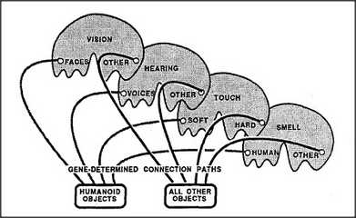

# Figure Appendix-1 — A person-recognizing agency

**File:** `appendix/Appendix-1.png`
**Appears in:** [../../som-appendix.md](../../som-appendix.md) — *The genesis of mental realms*

## What the image shows

A schematic line drawing of a layered recognition agency. Across the
top sit large lobed shapes labelled **VISION**, **HEARING**, **TOUCH**,
and **SMELL**, each containing smaller pockets for specialized sensors:
**FACES** and **OTHER** under vision; **VOICES** and **OTHER** under
hearing; **SOFT** and **HARD** under touch; **HUMAN** and **OTHER**
under smell. Black wires run downward from the human-relevant sensors
(faces, voices, soft touch, human odour) into a box at the bottom
labelled **HUMANOID OBJECTS**. Wires from the **OTHER** sensors run
into a second box labelled **ALL OTHER OBJECTS**. The two paths are
captioned **GENE-DETERMINED CONNECTION PATHS**.

## What it illustrates

Minsky's *predestined learning* argument: genes need not encode the
idea of a person, only the wiring that routes outputs from
person-relevant sensors into a dedicated evidence-weighing agency. That
agency has no choice but to learn to represent humans, because that is
all its inputs ever see. The figure is the appendix's first concrete
example of how an inherited architecture can produce an inherited
concept.
