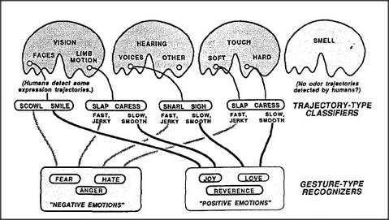

# Figure Appendix-2 — Trajectory-type and gesture-type recognizers

**File:** `appendix/Appendix-2.png`
**Appears in:** [../../som-appendix.md](../../som-appendix.md) — *Gestures and trajectories*

## What the image shows

The same layered-agency template as Appendix-1, redrawn for emotional
recognition. Four lobed regions across the top — **VISION**,
**HEARING**, **TOUCH**, and **SMELL** — each contain pockets for
specialized sensors: **FACES** and **LIMB MOTION** under vision (with a
note that *Humans detect some expression trajectories*); **VOICES** and
**OTHER** under hearing; **SOFT** and **HARD** under touch; smell is
left empty, with the note *No odor trajectories detected by humans*. A
middle row of bracketed pairs reads **SCOWL / SMILE**, **SLAP /
CARESS**, **SNARL / SIGH**, **SLAP / CARESS**, each annotated *FAST,
JERKY* versus *SLOW, SMOOTH*. These are labelled **TRAJECTORY-TYPE
CLASSIFIERS**. At the bottom, wires converge into two boxes:
**NEGATIVE EMOTIONS** (containing **FEAR**, **HATE**, **ANGER**) and
**POSITIVE EMOTIONS** (containing **JOY**, **LOVE**, **REVERENCE**).
The whole bottom band is labelled **GESTURE-TYPE RECOGNIZERS**.

## What it illustrates

Cross-modal gesture recognition. The same sudden, jerky temporal
pattern that a face's scowl produces in vision also appears as a snarl
in hearing and as a slap in touch; the same smooth pattern shows up as
a smile, sigh, and caress. By wiring all trajectory-type detectors of a
given shape into a single central recognizer, the brain can build an
abstract *anger* or *affection* agent that is detached from any one
sensory modality. This is the architectural basis for Minsky's account
of how genes can predispose us to specific empathies.
