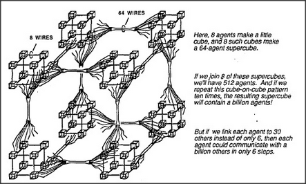

# Figure Appendix-3 — A cube-on-cube supercube of agents

**File:** `appendix/Appendix-3.png`
**Appears in:** [../../som-appendix.md](../../som-appendix.md)

## What the image shows

A perspective drawing of a large lattice made of smaller cubes nested
inside cubes. A small annotation marks **8 WIRES** running into a
single corner cube, and **64 WIRES** running into the larger
super-corner. Three captions sit to the right:

- "Here, 8 agents make a little cube, and 8 such cubes make a 64-agent
  supercube."
- "If we join 8 of these supercubes, we'll have 512 agents. And if we
  repeat this cube-on-cube pattern ten times, the resulting supercube
  will contain a billion agents!"
- "But if we link each agent to 30 others instead of only 6, then each
  agent could communicate with a billion others in only 6 steps."

## What it illustrates

The appendix's combinatorial sketch of how very small local
connectivity can still yield very short global path lengths. The
recursive cube construction shows exponential growth in population
without growing the local fanout, and the closing remark previews the
small-world argument that a brain-sized society of agents can stay
tightly interconnected on the cheap.
