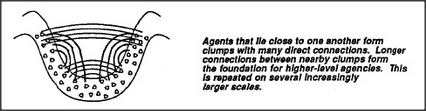

# Figure Appendix-4 — Local clumps and longer connections

**File:** `appendix/Appendix-4.png`
**Appears in:** [../../som-appendix.md](../../som-appendix.md)

## What the image shows

A horizontal cross-section drawn as a shallow basin. The basin is
filled with a dense scatter of small dots representing individual
agents. Curved lines sweep across the basin, denser near the centre
and arching outward to the rims. A caption to the right reads: "Agents
that lie close to one another form clumps with many direct
connections. Longer connections between nearby clumps form the
foundation for higher-level agencies. This is repeated on several
increasingly larger scales."

## What it illustrates

Minsky's image of hierarchy as a stack of clumps. Short, dense
local wiring builds tight low-level agencies; sparser long-range wires
between clumps assemble the next level up. The same pattern is then
applied at the next scale, and the next. Higher-level agencies are not
new substances — they are clumps of clumps.
