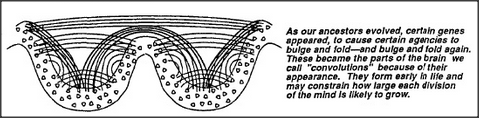

# Figure Appendix-5 — Genes constrain the convolutions

**File:** `appendix/Appendix-5.png`
**Appears in:** [../../som-appendix.md](../../som-appendix.md)

## What the image shows

Two scalloped basins side by side, similar in style to Appendix-4 but
folded into a double pocket. Each pocket holds a dense scatter of dots
and a fan of crossing arcs. The caption to the right reads: "As our
ancestors evolved, certain genes appeared, to cause certain agencies
to bulge and fold — and bulge and fold again. These became the parts
of the brain we call *convolutions* because of their appearance. They
form early in life and may constrain how large each division of the
mind is likely to grow."

## What it illustrates

The transition from a smooth sheet of agents to a folded, partitioned
one. Where Appendix-4 showed a single basin, this figure shows the
same construction divided into two by an inherited fold. Genes that
control early folding therefore put hard upper limits on how big any
one division of the mind can become — a structural cap on the size of
any single agency.
