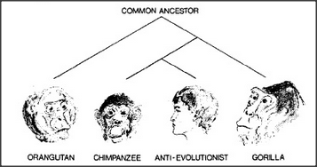

# Figure Appendix-6 — The anti-evolutionist among the apes

**File:** `appendix/Appendix-6.png`
**Appears in:** [../../som-appendix.md](../../som-appendix.md)

## What the image shows

A small phylogenetic tree. At the top, a node labelled **COMMON
ANCESTOR** branches into four portraits at the bottom: an
**ORANGUTAN**, a **CHIMPANZEE**, an **ANTI-EVOLUTIONIST** (a stern
human in profile), and a **GORILLA**. The three apes are drawn in
naturalistic pencil; the human face is drawn in the same register and
sits between the chimpanzee and the gorilla as one of four equally
weighted descendants.

## What it illustrates

A wry visual joke. By placing the *anti-evolutionist* on the same
branching diagram as the apes and giving the figure the same artistic
treatment, the illustration makes its argument without saying a word:
the position that humans stand outside the tree is itself a position
on the tree. The image punctuates the appendix's broader point that
human nature is one inherited architecture among others.
