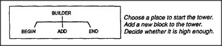

# Figure 1-2 — The BUILDER agent and its three sub-agents

**File:** `ch1/1-2.png`
**Appears in:** [../../som-1.4.md](../../som-1.4.md) — *The world of blocks*

## What the image shows

A simple two-line hierarchy diagram. A box labelled **BUILDER** at the
top connects downward by three lines to three children labelled
**BEGIN**, **ADD**, and **END**. To the right, a brief caption reads:
"Choose a place to start the tower. Add a new block to the tower.
Decide whether it is high enough."

## What it illustrates

The first concrete picture of an *agent that is really an agency*.
BUILDER does nothing on its own; turning it on simply turns on three
smaller specialists in sequence. The figure introduces the
hierarchical decomposition Minsky will use throughout the chapter to
turn a single capability ("build a tower") into a society of cheaper,
narrower workers.
