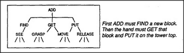

# Figure 1-3 — Unpacking the ADD agent

**File:** `ch1/1-3.png`
**Appears in:** [../../som-1.4.md](../../som-1.4.md) — *The world of blocks*

## What the image shows

A small tree. At the top sits **ADD**. Below it are two children,
**FIND** and **GET** and **PUT** (three branches in a row). Each of
those in turn has its own pair of workers: **SEE** and **GRASP** under
FIND/GET; **MOVE** and **RELEASE** under PUT. A caption to the right
reads: "First ADD must FIND a new block. Then the hand must GET that
block and PUT it on the tower top."

## What it illustrates

The recursion continues. ADD, which looked atomic in Figure 1-2, turns
out itself to be an agency of three workers, each of which is again an
agency of two. The picture makes Minsky's point that "agent" and
"agency" are points of view on the same object — one level's agent is
always the next level's society.
