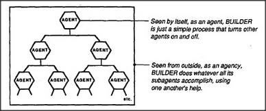

# Figure 1-4 — Agent versus agency

**File:** `ch1/1-4.png`
**Appears in:** [../../som-1.4.md](../../som-1.4.md) — *The world of blocks* &nbsp;·&nbsp; [../../som-1.6.md](../../som-1.6.md) — *Agents and Agencies*

## What the image shows

A pyramid of hexagonal cells labelled **AGENT**. One cell at the top
fans out to two below it, those two to four below them, and the
bottom row trails off with an "etc." A bracket on the right pairs the
diagram with two captions:

- "Seen by itself, as an agent, BUILDER is just a simple process that
  turns other agents on and off."
- "Seen from outside, as an agency, BUILDER does whatever all its
  subagents accomplish, using one another's help."

## What it illustrates

The figure that anchors the agent/agency distinction. The very same
hexagon at the apex is *an agent* if you stand outside it and *an
agency* if you stand inside it. Minsky uses the diagram to argue that
the apparent unity of any mental act is a perspective effect: zoom out
and you see one worker; zoom in and you see a crowd.
