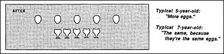

# Figure 10-2 — Piaget's eggs and cups, AFTER

**File:** `ch10/10-2.png`
**Appears in:** [../../som-10.1.md](../../som-10.1.md) — *Piaget's experiments*

## What the image shows

A panel labelled **AFTER**. The top row now holds the same five eggs
spread further apart so that the row is visibly wider than the row of
five cups beneath it. Two captions sit to the right: *"Typical
5-year-old: 'More eggs.'"* and *"Typical 7-year-old: 'The same, because
they're the same eggs.'"*

## What it illustrates

The diagnostic moment of the conservation experiment. Spreading the
eggs apart leaves their number unchanged but changes their spatial
extent. Younger children let the visual change override the count,
while older children appeal to history — the eggs are the same
eggs — and override appearance. The figure motivates Minsky's
claim that *more* is not one concept but a society of competing
agents with shifting priorities.
