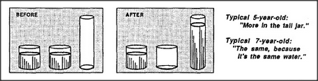

# Figure 10-3 — Piaget's water-jar experiment

**File:** `ch10/10-3.png`
**Appears in:** [../../som-10.1.md](../../som-10.1.md) — *Piaget's experiments*

## What the image shows

Two side-by-side panels labelled **BEFORE** and **AFTER**. In the
*before* panel, two short, wide jars holding equal levels of water
stand beside a tall, empty, thin jar. In the *after* panel, one of
the short jars is empty and the tall jar is filled — the water
column reaching far higher than the level in the remaining short jar.
Two captions read, *"Typical 5-year-old: 'More in the tall jar.'"* and
*"Typical 7-year-old: 'The same, because it's the same water.'"*

## What it illustrates

Piaget's conservation-of-liquid experiment, the twin to the eggs and
cups. Pouring conserves volume but changes height and width
dramatically. Younger children, dominated by the Tall agent, judge
*more*; older children, dominated by Confined, judge *same*. The
figure is the data the *Society-of-More* (figures
[10-4.md](10-4.md) through [10-8.md](10-8.md)) is built to account
for.
