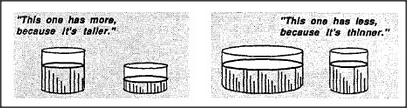

# Figure 10-4 — Tall and Thin in isolation

**File:** `ch10/10-4.png`
**Appears in:** [../../som-10.3.md](../../som-10.3.md) — *Priorities*

## What the image shows

Two side-by-side comparison vignettes. On the left, a tall narrow
beaker stands beside a short wide beaker, both partly filled, with
the caption *"This one has more, because it's taller."* On the right,
a wide squat beaker stands beside a narrower beaker of similar height,
with the caption *"This one has less, because it's thinner."*

## What it illustrates

Evidence that young children already possess the Tall and Thin
agents as independent judges. Each agent fires correctly in a
context where it is the only relevant cue. The conflict that drives
the water-jar puzzle arises only when the two agents — together
with Confined — give different verdicts on the same scene.
