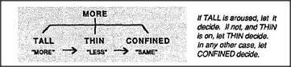

# Figure 10-5 — Priority ordering of MORE's children

**File:** `ch10/10-5.png`
**Appears in:** [../../som-10.3.md](../../som-10.3.md) — *Priorities*

## What the image shows

A small inverted-tree diagram. A box labelled **MORE** sits at the
top with three children arranged left to right: **TALL**, **THIN**,
and **CONFINED**, each tagged with its verdict — *"more"*,
*"less"*, *"same"*. Arrows pointing rightward through the children
indicate a fall-through order of evaluation. A caption to the right
reads, *"If TALL is aroused, let it decide. If not, and THIN is on,
let THIN decide. In any other case, let CONFINED decide."*

## What it illustrates

The simplest possible conflict-resolution scheme: a fixed priority
list. It explains why a young child reaches a verdict at all when
its three agents disagree, and why that verdict is so often wrong —
the priority order privileges the visible cue over the historical
one. The figure sets up the need for the more flexible
*administrative* layer introduced in [10-6.md](10-6.md).
