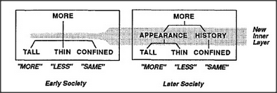

# Figure 10-6 — A new inner layer: APPEARANCE and HISTORY

**File:** `ch10/10-6.png`
**Appears in:** [../../som-10.4.md](../../som-10.4.md) — *Papert's principle*

## What the image shows

Two diagrams side by side, captioned *Early Society* and *Later
Society*. The left tree has **MORE** directly above **TALL**, **THIN**,
**CONFINED** (the figure from [10-5.md](10-5.md)). The right tree
inserts a new horizontal band between MORE and the three originals:
**APPEARANCE** sits over TALL and THIN, **HISTORY** sits over CONFINED.
A label points to this band and reads **New Inner Layer**.

## What it illustrates

Papert's principle made literal. Growth is not the addition of more
low-level skills but the insertion of administrative agents that
group existing skills by kind. APPEARANCE arbitrates the perceptual
agents that conflict in the water-jar scene; HISTORY speaks for
Confined. The choice of grouping is what makes the older child's
judgment robust — and what makes the wrong grouping disastrous.
