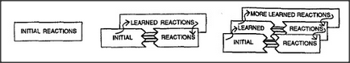

# Figure 10-9 — Building a detour around an old system

**File:** `ch10/10-9.png`
**Appears in:** [../../som-10.9.md](../../som-10.9.md) — *Learning a hierarchy*

## What the image shows

Three boxes in a row showing successive stages of one process. Stage
one: a single box labelled **INITIAL REACTIONS**. Stage two: the same
box, joined by arrows to a new box labelled **LEARNED REACTIONS**
positioned above it. Stage three: the previous pair, with a further
**MORE LEARNED REACTIONS** box added above, all three connected by
two-way arrows.

## What it illustrates

Minsky's safe-growth strategy for a working brain. New competence is
not built by editing the old machinery but by laying down a parallel
layer beside it that can be exercised, criticised, and, once trusted,
allowed to intercept the older path. The figure justifies the rest of
the chapter: hierarchies grow by accretion of layers, not by
rewriting.
