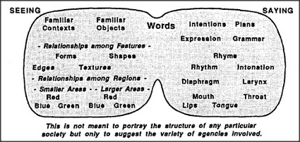

# Figure 11-1 — From sensors to the word "red"

**File:** `ch11/11-1.png`
**Appears in:** [../../som-11.1.md](../../som-11.1.md) — *Seeing red*

## What the image shows

A small left-to-right diagram. On the left, a row of colour-sensor
boxes feeds into a labelled **red-agent** in a central cluster of
mental agencies. A line then runs to a **pronouncing agent**, which
in turn connects to a stylised mouth pronouncing the word *RED*.

## What it illustrates

The minimal chain that would let a machine *say* the name of a
colour: hue sensors → an agent that detects the colour → an agent
that pronounces the corresponding word. The figure exists so that
Minsky can then deny that this is anything like seeing red — a
real perception is embedded in a far wider society of texture, form,
memory, and meaning.
