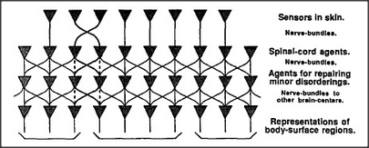

# Figure 11-2 — Parallel nerve bundles from skin to brain

**File:** `ch11/11-2.png`
**Appears in:** [../../som-11.3.md](../../som-11.3.md) — *Nearnesses*

## What the image shows

A schematic with a patch of **SKIN** on one side and a patch of
**BRAIN** on the other. Between them, a bundle of parallel lines
connects skin spots to brain spots. Most lines run straight, but a
few cross over, illustrating the imperfections of the actual
projection.

## What it illustrates

Why nearness on the skin tends to map to nearness in the brain:
nerves run in roughly parallel bundles, so stimulating adjacent skin
spots arouses neighbouring brain regions. The figure prepares the
argument that a brain agency can *discover* skin topology from
correlated activity, while also acknowledging that the mapping is
irregular enough to require tidying.
