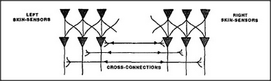

# Figure 11-3 — Mirror-image hemispheres

**File:** `ch11/11-3.png`
**Appears in:** [../../som-11.8.md](../../som-11.8.md) — *Half-brains*

## What the image shows

A top-down outline of a brain split down the midline. The left and
right halves contain matching arrangements of labelled regions drawn
as mirror images of one another. A thick band of parallel
cross-connections runs between them at the centre, representing the
inter-hemispheric fibre bundles.

## What it illustrates

The architectural fact that grounds the rest of the section: most
brain agencies come in left/right pairs joined by massive bundles of
crossing fibres. The figure lets Minsky pose his question — what is
that symmetry *for*? — and then push back against the
left-brain/right-brain mythology that grew up around it.
