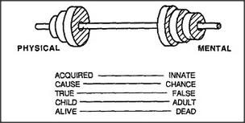

# Figure 11-4 — Pairs of opposing words

**File:** `ch11/11-4.png`
**Appears in:** [../../som-11.9.md](../../som-11.9.md) — *Dumbbell theories*

## What the image shows

Two columns of paired words, set face to face across a vertical
gutter. The pairs include such oppositions as *Good / Bad*,
*Right / Wrong*, *Truth / Falsity*, *Body / Mind*, *Inside /
Outside*, *Same / Different*, and similar two-pole splits. Each
pair is drawn so the reader sees both poles at once.

## What it illustrates

The everyday habit of carving the world into two-part oppositions.
Minsky offers the figure as a catalogue of *dumbbell* schemes —
useful starting points, but treacherous when one stops looking for
the missing third alternative. It sets up the warning of
[11-5.md](11-5.md) that many of these oppositions are
structurally so similar that they invite false analogies.
