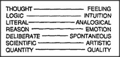

# Figure 11-5 — The Thought / Feeling dumbbell

**File:** `ch11/11-5.png`
**Appears in:** [../../som-11.9.md](../../som-11.9.md) — *Dumbbell theories*

## What the image shows

Two columns of paired words again, but with a sharper alignment. On
the left, terms like *Thought*, *Reason*, *Logical*, *Mechanical*,
*Cool*, *Head*. On the right, their counterparts *Feeling*,
*Emotion*, *Analogical*, *Vital*, *Warm*, *Heart*. The columns are
drawn so the reader's eye runs down both at once and notices that
they all line up in the same direction.

## What it illustrates

The seductive trick that makes dumbbell theories feel deep: many
unrelated oppositions can be slotted into the same Thought/Feeling
template, so any one of them appears to corroborate the others.
The figure is the visual evidence for Minsky's caution that this
apparent unity is an artefact of our taste for two-part divisions,
not a discovery about the mind.
