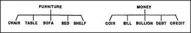

# Figure 12-10 — Accumulations: furniture and money

**File:** `ch12/12-10.png`
**Appears in:** [../../som-12.6.md](../../som-12.6.md) — *Accumulation*

## What the image shows

Two small trees side by side. The left has **FURNITURE** as its
root with leaves **CHAIR**, **TABLE**, **SOFA**, **BED**, **SHELF**.
The right has **MONEY** as its root with leaves **COIN**, **BILL**,
**BULLION**, **DEBT**, **CREDIT**.

## What it illustrates

Two concepts that resist uniframing. The leaves of *furniture*
share neither shape nor parts; the leaves of *money* span the
physical and the purely contractual. When no compact description
covers all the examples, the only thing left to do is to keep the
list — an *accumulation*. The figure marks the boundary
between cases where a uniframe pays off and cases where it does not.
