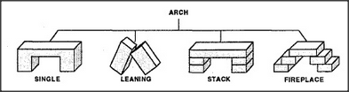

# Figure 12-11 — Arches that escape the Block-Arch uniframe

**File:** `ch12/12-11.png`
**Appears in:** [../../som-12.6.md](../../som-12.6.md) — *Accumulation*

## What the image shows

Four line drawings under a common heading **ARCH**, each labelled
beneath: **SINGLE** (a one-piece arched form), **LEANING** (two
blocks resting against each other to form a triangular gap),
**STACK** (a stepped corbelled gap built up from many blocks), and
**FIREPLACE** (a deeper rectangular hearth opening framed by stacked
blocks).

## What it illustrates

Real-world arches that are clearly arches yet violate the tidy
*two standing blocks and a top* uniframe of [12-4.md](12-4.md).
The figure is evidence that even a well-formed uniframe will not
cover the whole accumulation a competent speaker recognises — and
prepares the next section's argument for combining uniframes with
sub-accumulations.
