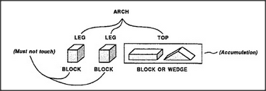

# Figure 12-12 — A uniframe with an embedded accumulation

**File:** `ch12/12-12.png`
**Appears in:** [../../som-12.8.md](../../som-12.8.md) — *Problems of disunity*

## What the image shows

A small tree rooted at **ARCH** with three children: **LEG**,
**LEG**, **TOP**. The first two each point to **BLOCK**; the third
points to a node **BLOCK OR WEDGE**, drawn as a side-by-side pair of
shapes and tagged as an **Accumulation**. A side note on the
leg branches reads **(Must not touch)**.

## What it illustrates

A hybrid representation. The body of the uniframe enforces the
shared structure (two non-touching legs and a top); the *top* slot
admits a small accumulation of alternatives. The figure is the
chapter's resolution: real concepts mix uniform descriptions with
short lists at the places where uniformity gives out — bridges
between two realms of thought, with an accumulation at the end of
whichever realm refuses to unify.
