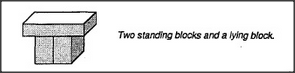

# Figure 12-2 — Near-arch with touching standing blocks

**File:** `ch12/12-2.png`
**Appears in:** [../../som-12.1.md](../../som-12.1.md) — *A block-arch scenario*

## What the image shows

A line drawing similar to [12-1.md](12-1.md), but the two standing
blocks are pushed together so they touch along their vertical faces.
A long block lies across the top. The same caption is reused:
*Two standing blocks and a lying block.*

## What it illustrates

A counterexample that fits the child's current description yet fails
the *push the car through it* test. The figure forces the learner
to refine the description — *the standing blocks must not touch*
— illustrating Minsky's point that learning a concept is mostly
the work of discovering the right exclusions.
