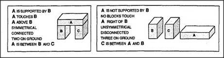

# Figure 12-5 — All the differences one could enforce

**File:** `ch12/12-5.png`
**Appears in:** [../../som-12.3.md](../../som-12.3.md) — *Uniframes*

## What the image shows

Two side-by-side panels, each picturing three labelled blocks A, B,
C and listing the relations that hold in that scene. The left panel
shows an arch (*A IS SUPPORTED BY B, A TOUCHES B, A ABOVE B,
SYMMETRICAL, CONNECTED, TWO ON GROUND, A IS BETWEEN B AND C*). The
right panel shows three blocks lying flat in a row with the
opposite list (*A IS NOT SUPPORTED BY B, NO BLOCKS TOUCH, A RIGHT OF
B, UNSYMMETRICAL, DISCONNECTED, THREE ON GROUND, C IS BETWEEN A AND
B*).

## What it illustrates

How many differences a learner *could* notice between a positive and
a negative instance. The point of the figure is that most of these
differences are redundant or accidental — *A supported by B*
already entails *A above B* and *A touches B* — and a good
uniframe chooses a small, essential subset rather than recording
everything. It is the visual argument for Minsky's *don't notice
too much* rule.
