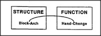

# Figure 12-6 — Structure linked to function

**File:** `ch12/12-6.png`
**Appears in:** [../../som-12.4.md](../../som-12.4.md) — *Structure and function*

## What the image shows

Two boxes side by side. The left is labelled **STRUCTURE** and
contains the node **Block-Arch**; the right is labelled **FUNCTION**
and contains **Hand-Change**. A curved arrow connects the two
nodes.

## What it illustrates

The minimal bridge needed to give a word a meaning: a structural
description on one side, a functional consequence on the other, with
a learned link between them. When an adult says *I see you've built
an arch*, the child needs both halves so that the word *arch*
attaches to a thing and to what that thing does.
