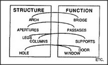

# Figure 12-7 — A bridge of structure-to-function pairs

**File:** `ch12/12-7.png`
**Appears in:** [../../som-12.4.md](../../som-12.4.md) — *Structure and function*

## What the image shows

The same STRUCTURE / FUNCTION boxes as [12-6.md](12-6.md), now
populated with multiple entries on each side. On the left,
**ARCH**, **APERTURES**, **LEGS**, **COLUMNS**, **HOLE**; on the
right, **BRIDGE**, **PASSAGES**, **SUPPORTS**, **DOOR**, **WINDOW**.
A web of curved arrows criss-crosses between them. A small *ETC.*
sits below.

## What it illustrates

Why one idea is rarely tied to just one role. A single structural
description like *arch* can be reused for many functions
(passage, support, doorway, window-frame), and any function can be
filled by many structures. The figure visualises the *bridge*
metaphor that closes the section: powerful thinking comes from
maintaining many cross-links between the two realms.
