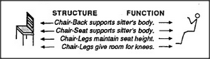

# Figure 12-8 — A chair as structure-plus-function

**File:** `ch12/12-8.png`
**Appears in:** [../../som-12.5.md](../../som-12.5.md) — *The function of structures*

## What the image shows

On the left, a small drawing of a chair seen in profile. On the
right, a stylised seated figure. Between them, four annotated
links pair a chair-part with the body-need it serves:
*Chair-Back supports sitter's body*, *Chair-Seat supports
sitter's body*, *Chair-Legs maintain seat height*, *Chair-Legs give
room for knees.* Headings **STRUCTURE** and **FUNCTION** label the
two sides.

## What it illustrates

The intimate, part-by-part bridging that gives the word *chair*
its meaning. Recognising a chair is not enough; one also needs the
mapping from each of its parts to a requirement of the human body.
The figure shows how a uniframe earns its keep — by carrying
enough internal detail that the concept can be used, not merely
recognised.
