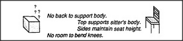

# Figure 12-9 — A box pressed into service as a chair

**File:** `ch12/12-9.png`
**Appears in:** [../../som-12.5.md](../../som-12.5.md) — *The function of structures*

## What the image shows

On the left, a plain cube drawn with question marks hovering above
it. On the right, a stick figure seated rigidly upon it. Between
them, a checklist: *No back to support body. Top supports sitter's
body. Sides maintain seat height. No room to bend knees.*

## What it illustrates

How the same structure-to-function mapping that defines a chair lets
us improvise one from an unfamiliar object. The reasoning succeeds
on two clauses (top supports the body; sides set the height) and
flags the missing clauses (no back, no leg-room) as the limits of
the substitution. The figure makes Minsky's point that a good
uniframe is also a tool for reformulation — for stretching old
concepts to fit new circumstances.
