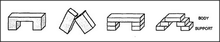

# Figure 13-1 — Four kinds of arch

**File:** `ch13/13-1.png`
**Appears in:** [../../som-13.1.md](../../som-13.1.md) — *Reformulation*

## What the image shows

Four small line drawings arranged in a row, each captioned below.
**SINGLE** is a single solid form with an opening cut through it.
**TOWER** is built of many small blocks stacked into two columns
with a stepped opening between them. **LEAN** is two blocks tilted
against each other so they meet at the top. **WEDGE** has two
upright supports with a triangular wedge laid across.

## What it illustrates

A line-up of objects that all deserve the name *arch* yet share
almost no measurable feature in the language of blocks. The figure
sets up the chapter's central question: when no uniframe can be
written in the original vocabulary, the solution is to change
vocabularies — to *reformulate*.
