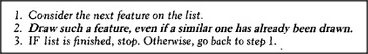

# Figure 13-10 — The revised drawing procedure

**File:** `ch13/13-10.png`
**Appears in:** [../../som-13.4.md](../../som-13.4.md) — *Children's drawing-frames*

## What the image shows

A small framed checklist with three numbered steps in italics:
*1. Consider the next feature on the list. 2. Draw such a
feature, even if a similar one has already been drawn. 3. If list
is finished, stop. Otherwise, go back to step 1.*

## What it illustrates

The single edit that turns a body-head conflation into a separated
body and head. Step 2 no longer asks *is one already drawn?* —
it simply draws the next feature regardless. The figure is
Minsky's example of how a small change in bookkeeping is worth
more than a change in the underlying description, and quietly links
this advance to the child's developing ability to count each thing
once.
