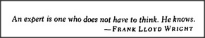

# Figure 13-11 — Frank Lloyd Wright on expertise

**File:** `ch13/13-11.png`
**Appears in:** [../../som-13.5.md](../../som-13.5.md) — *Learning a script*

## What the image shows

A single horizontal banner of text presented as a quotation:
*"An expert is one who does not have to think. He knows."* —
Frank Lloyd Wright

## What it illustrates

The epigraph that opens the section. It frames the rest of the
discussion: practice is not a way to think faster but a way to
build *scripts* that bypass thinking altogether. The figure
prepares the contrast made explicit in [13-12.md](13-12.md)
between a deliberative *program* and a compiled *script*.
