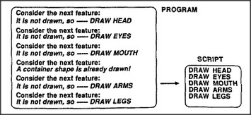

# Figure 13-12 — Program collapsing into a script

**File:** `ch13/13-12.png`
**Appears in:** [../../som-13.5.md](../../som-13.5.md) — *Learning a script*

## What the image shows

Two boxes side by side. The left, labelled **PROGRAM**, lists six
deliberative steps in pairs — *Consider the next feature: / It is
not drawn, so —— DRAW HEAD*, then the same for **EYES**,
**MOUTH**, then *Consider the next feature: / A container shape is
already drawn!*, then *DRAW ARMS*, *DRAW LEGS*. An arrow leads to
the right box, labelled **SCRIPT**, which lists only the five raw
drawing acts: **DRAW HEAD**, **DRAW EYES**, **DRAW MOUTH**, **DRAW
ARMS**, **DRAW LEGS**.

## What it illustrates

What practice produces. The left side shows the novice's busy
deliberation — checking each feature, deciding, then drawing.
The right side shows the same outcome stripped of every check, a
pure sequence of motor actions. The figure makes Minsky's point
that the speed of an expert is not faster thinking but the absence
of thinking, made possible by a precompiled script that bypasses
the agencies the novice has to consult.
