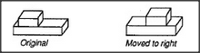

# Figure 13-13 — Block on block, moved a little to the right

**File:** `ch13/13-13.png`
**Appears in:** [../../som-13.6.md](../../som-13.6.md) — *The frontier effect*

## What the image shows

Two small line drawings of a short block resting on a longer one.
The left, captioned **Original**, shows the short block sitting
roughly centred on the long block. The right, captioned **Moved to
right**, shows the same pair after the short block has slid a
modest distance towards the long block's right end, still well
within its bounds.

## What it illustrates

Piaget's experiment in its normal state. When the displacement is
small the child draws it accurately. The figure is the baseline
against which [13-14.md](13-14.md) reveals the surprise — that
once the upper block approaches the long block's edge, the
drawing collapses.
