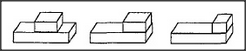

# Figure 13-14 — The short block shrinks at the frontier

**File:** `ch13/13-14.png`
**Appears in:** [../../som-13.6.md](../../som-13.6.md) — *The frontier effect*

## What the image shows

A row of three small drawings showing the same pair of blocks as in
[13-13.md](13-13.md), captured at successive moves to the right.
In the first two panels the upper block stays its proper length as
it slides along. In the third panel, where it has reached the
right end of the long block, the upper block is drawn distinctly
shorter — its right edge has been pulled in to coincide with the
long block's right edge.

## What it illustrates

The visible signature of the *frontier effect*. The child's
drawing procedure locates each new feature relative to other
features that are easy to describe; near the middle of the long
block there is nothing salient to anchor against, but the long
block's end is a strong landmark. As the short block approaches
that landmark, the procedure snaps the new edge to it, even at the
cost of distorting length.
