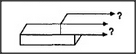

# Figure 13-15 — The child mid-stroke at the long block's edge

**File:** `ch13/13-15.png`
**Appears in:** [../../som-13.6.md](../../som-13.6.md) — *The frontier effect*

## What the image shows

A close-up sketch of an in-progress drawing. The long block has
been outlined; on top of it, a partial outline of the short block
is being drawn left to right, but its upper edge has been continued
past the right end of the long block. Two question-marked arrows
sprout from the end of the partial outline, asking where the line
should stop.

## What it illustrates

The child's predicament from the inside. With no nearby landmark
to fix the right edge of the short block, the only easy answer is
*stop where the long block stops*. The figure shows why the
frontier effect is not a perceptual mistake but a procedural
shortcut: the most describable place wins, and length proportions
lose.
