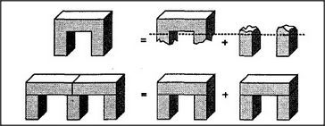

# Figure 13-16 — Single arch and double arch, parsed two ways

**File:** `ch13/13-16.png`
**Appears in:** [../../som-13.7.md](../../som-13.7.md) — *Duplications*

## What the image shows

Two rows of small drawings, each presented as an equation. The
top row reads **arch  =  body  +  supports**: a single arch is
shown equal to its lintel (the body) plus its two columns (the
supports), with a dashed line marking the imaginary boundary
between them. The bottom row reads **double-arch  =  arch  +
arch**: a wider shape with two openings is shown equal to two
arches that share a middle column, with the shared column drawn
once on each side of the equals sign.

## What it illustrates

Two situations in which the parts do not add up to a clean sum.
In the upper row, body and supports overlap because they describe
the same block from different points of view. In the lower row,
two arches *share* a middle support, so the same column is used
twice. The figure introduces the section's lesson: sometimes
counting twice is exactly right, and the choice between structural
and functional description is the choice between when to keep
score and when to let parts serve double duty.
