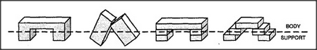

# Figure 13-2 — Body and supports drawn over the four arches

**File:** `ch13/13-2.png`
**Appears in:** [../../som-13.1.md](../../som-13.1.md) — *Reformulation*

## What the image shows

The same four arches from [13-1.md](13-1.md) redrawn with a dashed
line cutting across each one near the top. Above each dashed line
sits the part now labelled **BODY**; below it on either side sit
the parts now labelled **SUPPORT**. The blocky internal lines from
the previous figure are faded so that the new three-region view
dominates.

## What it illustrates

What reformulation looks like as a stroke of the pencil. By
imagining a line that need not coincide with any real block edge,
every arch in the row is brought under the same single description
— *a body resting on two supports*. The figure is the chapter's
working example of how a new vocabulary can rescue a uniframe the
old vocabulary could not capture.
