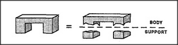

# Figure 13-3 — Inventing boundaries in Single-Arch

**File:** `ch13/13-3.png`
**Appears in:** [../../som-13.2.md](../../som-13.2.md) — *Boundaries*

## What the image shows

The single-piece arch from [13-1.md](13-1.md) shown twice. On the
left it is one continuous form with no internal divisions. On the
right the same outline is overlaid with two dashed vertical lines
that slice it into three labelled regions: **SUPPORT**, **BODY**,
**SUPPORT**.

## What it illustrates

The mind's freedom to *add* boundaries where the world supplies
none. A single physical object is partitioned into three functional
parts purely on the strength of the body-and-supports template. The
figure is half of the pair (with [13-4.md](13-4.md)) that shows
boundaries flowing in both directions between mind and scene.
