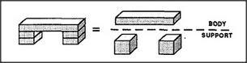

# Figure 13-4 — Erasing boundaries in Tower-Arch

**File:** `ch13/13-4.png`
**Appears in:** [../../som-13.2.md](../../som-13.2.md) — *Boundaries*

## What the image shows

The tower-built arch from [13-1.md](13-1.md) shown twice. On the
left, each small block is drawn with its own visible outline. On
the right, those internal block edges have been erased, leaving
three smooth labelled regions: **SUPPORT**, **BODY**, **SUPPORT**.

## What it illustrates

The complementary move to [13-3.md](13-3.md): the mind freely
*removes* boundaries the world provides. Many real bricks become
two pillars and a lintel as soon as the body-and-supports template
is applied. The figure makes vivid Minsky's point that perception
constantly redraws the boundaries of the scene to fit whatever
description is needed.
