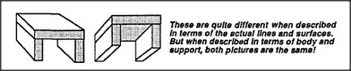

# Figure 13-5 — The same table from two viewpoints

**File:** `ch13/13-5.png`
**Appears in:** [../../som-13.2.md](../../som-13.2.md) — *Boundaries*

## What the image shows

Two small drawings of the same four-legged table. On the left, the
table is seen head-on: a rectangular top supported by two visible
legs, the other two hidden behind. On the right, the same table is
seen from a higher angle in perspective: the top now appears as a
foreshortened parallelogram and all four legs are visible at
different lengths.

## What it illustrates

How rarely any object is seen twice in literally the same shape.
For a learner to recognise both pictures as one table, the mind
must discard whichever boundaries do not matter and supply whichever
boundaries do. The figure justifies the chapter's claim that
without such constructive editing we could never recognise anything
at all.
