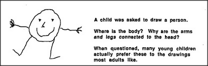

# Figure 13-6 — A child's drawing of a person

**File:** `ch13/13-6.png`
**Appears in:** [../../som-13.3.md](../../som-13.3.md) — *Seeing and believing*

## What the image shows

A small drawing in the style of a young child: one large round
shape stands for both the head and the body together; inside it
are two dot eyes and a curved mouth; four straight lines extend
straight from the same round shape — two upward as arms with
splayed fingers, two downward as legs ending in feet.

## What it illustrates

The puzzling picture that sets up the section. Children draw bodies
this way not because they cannot see better but because their
description of *person* is satisfied by what the picture
actually shows. The figure is the data the next two diagrams,
[13-7.md](13-7.md) and [13-8.md](13-8.md), are written to
explain.
