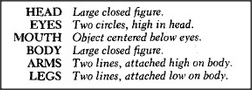

# Figure 13-7 — A feature-network for "person"

**File:** `ch13/13-7.png`
**Appears in:** [../../som-13.3.md](../../som-13.3.md) — *Seeing and believing*

## What the image shows

A small box headed **PERSON** with seven labelled slots inside:
**HEAD**, **EYES**, **MOUTH**, **BODY**, **ARMS**, **LEGS**, and
notes attaching the eyes and mouth to the head, the arms to the
body's upper part, and the legs to the body's lower part. Each
slot carries a short feature description (*large closed figure*,
*small closed figures*, *curve*, *large closed figure*, *long
lines, upper*, *long lines, lower*).

## What it illustrates

Minsky's alternative to a picture-in-the-head: the child stores not
an image but a small list of features and the relations they must
satisfy. Crucially, the **HEAD** slot and the **BODY** slot both
ask for *a large closed figure* — a coincidence that the
ordering procedure in [13-8.md](13-8.md) will exploit.
