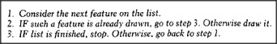

# Figure 13-8 — The child's drawing procedure as a checklist

**File:** `ch13/13-8.png`
**Appears in:** [../../som-13.3.md](../../som-13.3.md) — *Seeing and believing*

## What the image shows

A numbered list of small instructions arranged vertically:
**1. Draw a large closed figure for the HEAD.**
**2. If no BODY yet, draw a large closed figure for it.**
**3. Add EYES and MOUTH inside the head.**
**4. Attach long lines for ARMS at the upper part of the body.**
**5. Attach long lines for LEGS at the lower part of the body.**
Beside the list, a partial drawing grows step by step as the
procedure advances.

## What it illustrates

Why the child is satisfied with the strange picture from
[13-6.md](13-6.md). When step 2 checks for a *large closed figure*
and finds the one already drawn for the head, the body's
requirement is treated as met — and the limbs are then attached
to that same circle. The figure makes the description vs.
bookkeeping point: the trouble is not the description but the
absence of a check that the head and body must be *different*
large closed figures.
