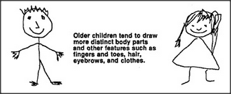

# Figure 13-9 — Older children's drawings of people

**File:** `ch13/13-9.png`
**Appears in:** [../../som-13.4.md](../../som-13.4.md) — *Children's drawing-frames*

## What the image shows

Two stick-figure portraits flank a central caption that reads,
*Older children tend to draw more distinct body parts and other
features such as fingers and toes, hair, eyebrows, and clothes.*
The left figure is a smiling boy with a crown of spiky hair; the
right figure is a girl with braided hair. Both have a clearly
separate round head, a distinct rectangular torso, and arms and
legs attached to the body rather than to the head.

## What it illustrates

The next stage after the body-equals-head drawing of
[13-6.md](13-6.md). The same feature list could in principle still
apply — what has changed is the bookkeeping, so that head and
body are no longer allowed to collapse onto the same closed figure.
The figure motivates the small but decisive procedural revision
shown in [13-10.md](13-10.md).
