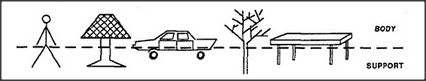

# Figure 14-1 — Body and support across many things

**File:** `ch14/14-1.png`
**Appears in:** [../../som-14.1.md](../../som-14.1.md) — *Using reformulation*

## What the image shows

A horizontal panel showing five outline drawings sitting on a
single ground line: a surveyor's transit on its tripod, a beach
umbrella, a side view of a car, a leafy tree, and a table. A
dashed line crosses each object near its waist. The right margin
labels the upper region **BODY** and the lower region **SUPPORT**.

## What it illustrates

How widely the body-support cut generalises. The same dashed line
separates instrument from servant in objects that share no
geometry — head from legs in the tripod, canopy from pole in
the umbrella, cabin from chassis in the car, foliage from trunk
in the tree, top from legs in the table. The figure prepares the
chapter's argument that reformulation often consists of
transporting one well-worn distinction into a new realm.
