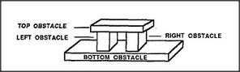

# Figure 14-11 — Four sides of the Block-Arch as four obstacles

**File:** `ch14/14-11.png`
**Appears in:** [../../som-14.6.md](../../som-14.6.md) — *parts and holes*

## What the image shows

The figure redraws the Block-Arch trap as a four-sided enclosure around a hand. The two upright pillars become the left and right obstacles, the lintel becomes the top obstacle, and the floor becomes the bottom obstacle. Each side is labelled with the direction it blocks, so that the four labels together cover the entire two-dimensional space of acceptable motions.

## What it illustrates

The figure makes concrete the reformulation Minsky proposes: a *trap* is not a single thing but four cooperating obstacles, each disabling one direction. By naming the floor as a side, the diagram converts the arch into a closed rectangle and prepares the ground for the Move agency of [14-14.md](14-14.md), where each obstacle will be wired to inhibit one direction-agent.
