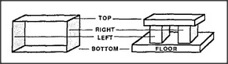

# Figure 14-12 — The two-dimensional container uniframe

**File:** `ch14/14-12.png`
**Appears in:** [../../som-14.6.md](../../som-14.6.md) — *parts and holes*

## What the image shows

A simple four-sided rectangle stands for a generic container. Each side is drawn as an edge with a direction-label attached — left, right, up, down — and the interior is left empty to denote *the region enclosed*. The figure is deliberately stripped of any reference to the original arch.

## What it illustrates

Stripping the Block-Arch of its surface details produces a uniframe for *container*. This uniframe is what later sections reuse to talk about boxes, rooms, and abstract enclosures — and, by analogy, about every situation where a set of constraints jointly forbids all directions. It is the same shape that the inhibitory wiring of [14-14.md](14-14.md) operates on, and the conceptual ancestor of the interaction-square in [14-15.md](14-15.md).
